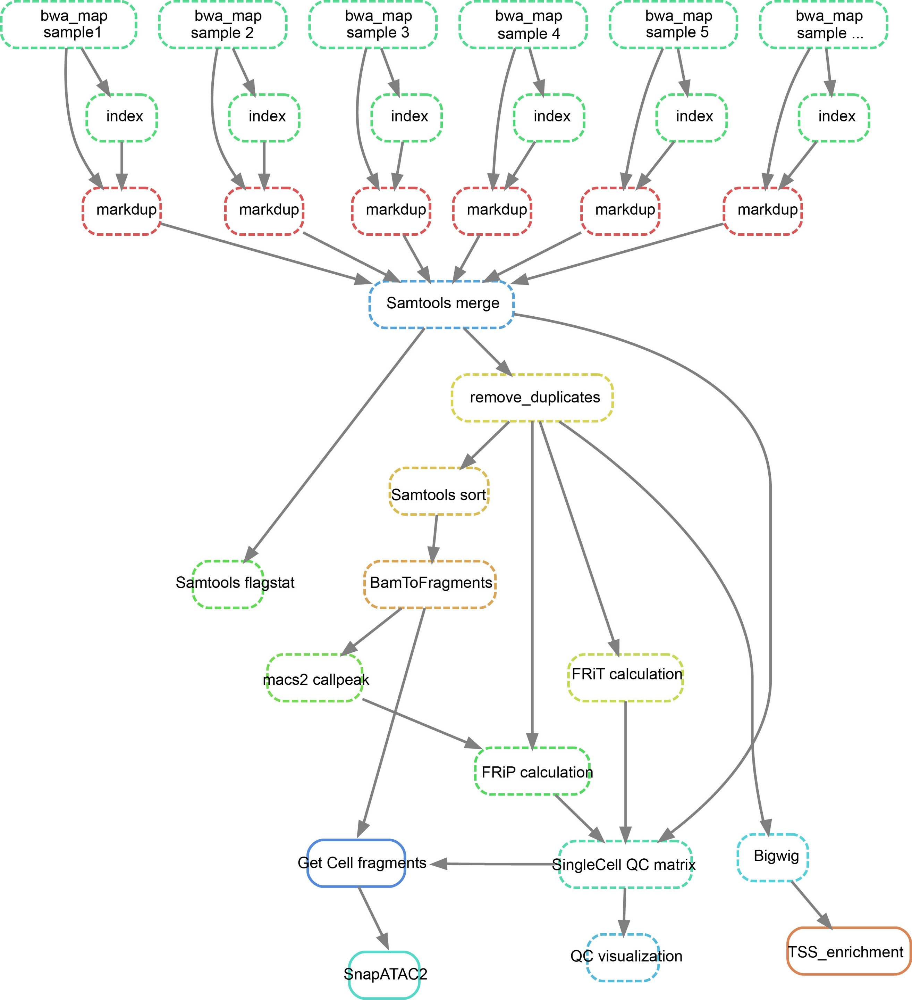

# Single-Cell FFPE Project

This repository contains the pipeline and scripts for processing single-cell FFPE data.

---
## workflow for scFFPE data preprocessing



## Software Requirements

- Python `3.9.16`
- computeMatrix `3.5.1`
- bamCoverage `3.5.1`
- plotHeatmap `3.5.1`
- Rscript (R) `4.3.1`
- plotProfile `3.5.1`
- sambamba `0.7.0`
- BWA `0.7.17-r1188`
- samtools `1.17`
- macs2 `2.1.2`
- snakemake `7.18.2`

---

## Package Requirements

### Python
- `pysam` = `0.22.0`
- `fuzzywuzzy` = `0.18.0`
- `Levenshtein` = `0.20.8`
- `pandas` = `1.4.0`
- `matplotlib` = `3.8.2`

### R (version 4.1.3)
- `ggplot2` = `3.3.6`
- `tidyverse` = `1.3.2`

---

## Installation

1. Download the pipeline to your own directory.
2. Modify `config.hg38.yaml` and `config.mm10.yaml`.
3. Install all required software and packages listed above.

---

## Usage

Check the scripts in the `example` folder.

---

## Input Format and Requirements for Debarcoding

### DNA Structure

R2 sequence with four structures: **5' → 3'** (paired with R1):

```
cell_bc1              cell_bc2             cell_bc3    linker   sample_index
ACGATTGNNNNNNNNNNNNNNNAAACCGGNNNNNNNNNNNNNNNACCCTAANNNNNNNNNNNNNNNAGANNNNNNNNNNNNNNNNNNN   -> ME -> genomicDNA -> ME-rev-com ->
ACGATTGNNNNNNNNNNNNNNNNAAACCGGNNNNNNNNNNNNNNNACCCTAANNNNNNNNNNNNNNNAGANNNNNNNNNNNNNNNNNNN   -> ME -> genomicDNA -> ME-rev-com ->
ACGATTGNNNNNNNNNNNNNNNNNAAACCGGNNNNNNNNNNNNNNNACCCTAANNNNNNNNNNNNNNNAGANNNNNNNNNNNNNNNNNNN   -> ME -> genomicDNA -> ME-rev-com ->
ACGATTGNNNNNNNNNNNNNNNNNNAAACCGGNNNNNNNNNNNNNNNACCCTAANNNNNNNNNNNNNNNAGANNNNNNNNNNNNNNNNNNN   -> ME -> genomicDNA -> ME-rev-com ->
```

### `barcode.txt` Format

The first column is the unique sample index.

```
[Sample_index]
Tn5_1    ATC
Tn5_2    TGA
Tn5_3    GCT
Tn5_4    CAG
Tn5_5    AGA
Tn5_6    TCT
Tn5_7    GAG
...

[Cell_BC1]
R02_#01    AAACCGG
R02_#02    AAACGTC
R02_#03    AAAGATG
R02_#04    AAATCCA
R02_#05    AAATGAG
...

[Cell_BC2]
R02_#01    AAACCGG
R02_#02    AAACGTC
R02_#03    AAAGATG
R02_#04    AAATCCA
R02_#05    AAATGAG
...

[Cell_BC3]
R02_#01    AAACCGG
R02_#02    AAACGTC
R02_#03    AAAGATG
R02_#04    AAATCCA
R02_#05    AAATGAG
...
```

### Run Debarcoding Script

```bash
python fastq_debarcoding.allow_mismatch.v3.1.py   -r1 temp.50m.R1_001.fastq.gz   -r2 temp.50m.R2_001.fastq.gz   -b barcode.txt   -o 01.debarcoding_17   -p 20   -ml 17
```

---

## Input Requirements for Single-Cell Data Processing

### `sample.group` Format

The first column contains the sample name for each unique sample index.  
The second column contains the sample index, which matches the entries in `barcode.txt`.

```
Spleen    Tn5_1
Spleen    Tn5_2
Spleen    Tn5_3
Spleen    Tn5_4
Spleen    Tn5_5
Spleen    Tn5_6
Spleen    Tn5_7
Spleen    Tn5_8
Spleen    Tn5_9
Spleen    Tn5_10
...
```

### Run Snakemake Pipeline

```bash
snakemake -s Snakefile   --configfile config.mm10.yaml   --cores 40   --config quality=2   --config FRiT=15   --config unique_frags=200
```

---

## Additional Steps

#### Extract Cells Based on FRiP or FRiT Manually

Run:

```bash
./extract_cell.sh
```

#### Get QC File for All Cells

Run:

```bash
./get_single_cell_qc.sh
```

Example QC table:

| barcode                   | total | Dups  | LowQ | Unpaired | Final | FRiP  | FRiT  |
|---------------------------|-------|-------|------|----------|-------|-------|-------|
| TGTCGTCTTGGTATG_Tn5_17    | 3     | 0.00  | 0    | 1        | 2     | 0.00  | 0.00  |
| CCCTTCCTTTGGATA_Tn5_35    | 98    | 8.67  | 13   | 2        | 80    | 13.75 | 20.00 |
| CCCGAACGTCGGTCA_Tn5_22    | 264   | 12.12 | 36   | 3        | 210   | 14.52 | 17.86 |
| CTATTCTCTCGTCAC_Tn5_20    | 414   | 13.04 | 77   | 8        | 313   | 13.74 | 13.74 |
| TAGTCTGGGATAAGA_Tn5_31    | 334   | 13.77 | 61   | 3        | 254   | 12.80 | 16.54 |
| TCTGACCCTTTCGGT_Tn5_27    | 551   | 12.89 | 136  | 8        | 404   | 10.52 | 13.24 |
| ATTATTCACCCAAGT_Tn5_8     | 2     | 0.00  | 0    | 0        | 2     | 0.00  | 0.00  |
| ATAAGGTAAATCACC_Tn5_21    | 2725  | 10.42 | 695  | 32       | 2061  | 6.91  | 11.52 |
| AATCTAACACGAGGT_Tn5_1     | 1266  | 12.56 | 207  | 16       | 987   | 10.89 | 15.50 |
